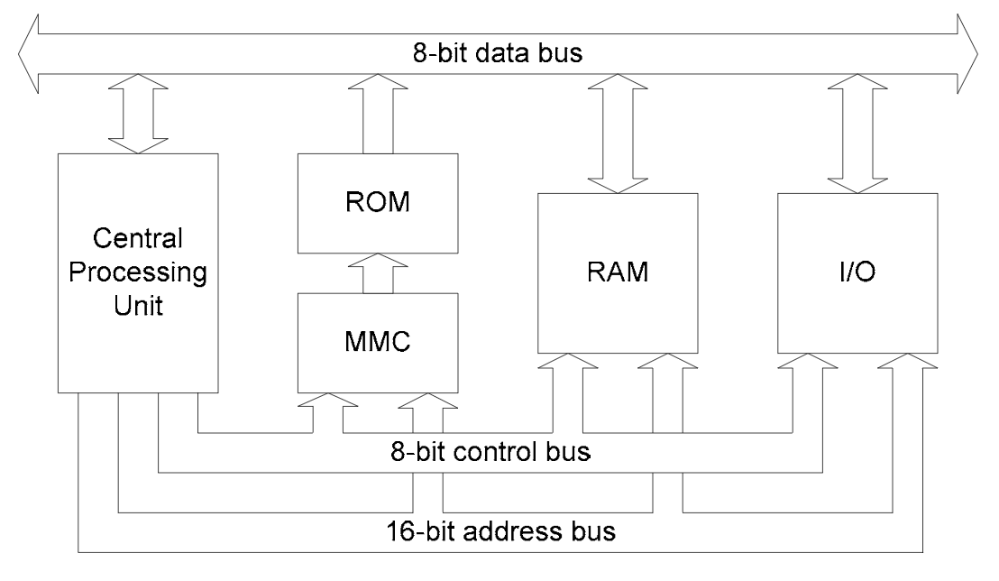

# Welcome to the emnes documentation!

Follow every step of the development process for this project here.

## Getting started

[Setting up the development environment](dev_env.md)

## Overval design

The emulator follows a very simple design for now. Take this processor diagram, taken on page 9
from [NESDOC.pdf](http://nesdev.com/NESDoc.pdf)

The CPU talks to a memory bus, which talks to different components: RAM, cartridge, picture processing unit, pseudo-audio processing unit, cartridge and input devices. Well,
we'll be taking the same approach for our emulator.

We'll have a [CPU](../emnes/cpu.py) class that talks to [MemoryBus](../emnes/memory_bus.py) class. That class will be responsible for routing
memory access to the right device.

## Code structure

| Folder           | Description  |
| ---------------- | --------------------------------------------------------------------------------------- |
| `emnes`          | Contains the main emulator classes: `CPU`, `MemoryBus`, `CartridgeReader`, `NES`, `PPU` |
| `emnes/mappers`  | Contains the classes that handle IO with the cartridge. The main class is `MapperBase`  |
| `emnes/readers`  | Contains the classes that parse roms from disk.                                         |

## Documents to read

Writing an emulator is a complex task, but thankfully a lot of clever people
have figured out how things work over the years, so if you follow the
documentation properly, you'll have at the very least a CPU up and running in no
time!

I've used the following resources while working on the emulator:

### General NES documentation

[NESDoc](http://nesdev.com/NESDoc.pdf): One of the best written document about
the workings of the internals of the NES. This is the first document you should
read to understand how the console works. It doesn't go into the details, but it
gives you an understanding of the task at hand and the different parts you need
to emulate.

[wiki.nesdev.com](http://wiki.nesdev.com): This is a treasure trove of information
on how to emulate or program for the NES. I won't link to any specific page because
there's just so much information.

### CPU documentation

[2A03 CPU Reference](http://obelisk.me.uk/6502/reference.html): Very clean and concise guide
to the NES CPU instruction set.

[MCS 6500 Microcomputer Family Programming Manual](http://archive.6502.org/books/mcs6500_family_programming_manual.pdf): Guide for the 6500 CPU family. This covers the instruction set in great detail and explains
how the CPU reacts in the various addressing modes and the small glitches in some of them.

[Easy 6502](https://skilldrick.github.io/easy6502/#stack): This is an online emulator for the
6502 CPU. Very useful to debug a set of instructions and understand how bits are set.

[64doc](http://atarihq.com/danb/files/64doc.txt) This is the Commodore 64 CPU timings documentation, which is the same CPU as the NES. It's fully documents when the CPU ticks. If you want to write a precise emulator which's clock
ticks at the right moment, this is the document to read. This is how I peperred my `CPU` code
with calls to `self._tick()`.

## Tests

When writing an emulator, you'll want to have a good test suite to make sure that any changes you make won't
introduce a regression. Thankfully, a lot of clever people have written roms that actually
allow you to test the behaviour of your emulator. I've commited the important ones in this repo and you
can find them [here](../tests/roms/README.md).

## Writing efficient Python code for an emulator

Here are a few tips and tricks to remember to write fast Python code.
- First try to get things working and reuse code as much as possible via common functions.
- Remember however that function calls are very expensive in Python. Avoid them as much as possible. It's often much faster to break down code inside a series of if's than trying to index into an array of functions. Don't forget that indexing into a list IS a function call, so now you're changing a bunch of simple comparisons with an expensive function call.
- Try to reuse code as much as possible, but also do not hesitate to have a little repetition when it makes sense. It's much better to repeat code sometimes than trying to refactor it, this causes more function calls.
